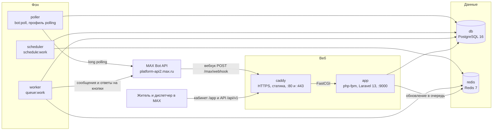

# Дом в срок

Бот и мини-приложение в MAX для ТСЖ и малых управляющих компаний. Житель подаёт заявку в боте и ещё до отправки видит, кто отвечает, в какой срок по нормативу и на каком основании. Диспетчер ведёт очередь с таймерами в кабинете внутри MAX, житель получает каждое изменение статуса и сам подтверждает результат. Аварии — звонок в аварийную службу, без заявки.

Хакатон MAX 2026, трек «Умный город».

| Что | Где |
|---|---|
| Бот | https://max.ru/t120_hakaton_max_bot |
| Сервер для проверки | https://chistoskaefom.ru (кабинет `/app`, API `/api/v1`, проверка здоровья `/up`) |
| Репозиторий | https://github.com/MrLincomins/dom-v-srok |
| Контракт API | `docs/openapi.yaml` (OpenAPI 3.1), проверки для платформы оценки — `docs/DATA-API.yaml` |
| Справочники | `docs/catalog.csv`, `docs/region-ru-ta.csv`, `docs/calendar-2026-2027.csv`, тексты бота — `docs/texts.csv` |

Разделы 1–15 повторяют обязательные пункты кейса в том же порядке.

## 1. Назначение

В ТСЖ и малых УК бытовые заявки жителей принимают по телефону и в домовых чатах, а записывают в тетрадь или не записывают вовсе. Житель не знает, кто отвечает за его проблему (организация дома, водоканал, лифтовая компания, региональный оператор ТКО) и сколько ждать; председатель ТСЖ не видит, какие заявки горят.

По п. 17 Правил осуществления деятельности по управлению многоквартирными домами (ПП РФ № 416) заявки в аварийно-диспетчерскую службу принимаются любыми средствами связи и регистрируются в журнале учёта заявок или в автоматизированной системе учёта; при регистрации жителю сообщают номер и регламентные сроки (п. 17(2)), контроль — фотофиксация и опросы жителей (п. 17(4)). «Дом в срок» даёт ТСЖ такую систему учёта внутри MAX: номер заявки, ответственный, срок и основание сразу при приёме, фото результата, подтверждение жителем и журнал учёта заявок (образец — Госстрой № 170, прил. 5) с выгрузкой в CSV.

Официальные обращения в органы власти и организации по-прежнему идут через ГИС ЖКХ и «Госуслуги Дом»: продукт их не заменяет, а ведёт учёт бытовых заявок жителей внутри дома.

## 2. Основной пользовательский сценарий

1. Житель сканирует QR-код в подъезде или нажимает «Сообщить о проблеме» в закреплённой карточке домового чата. Открывается бот по ссылке `https://max.ru/t120_hakaton_max_bot?start=h_<код дома>_<подъезд>`, дом и подъезд уже известны.
2. «Сообщить о проблеме» → «Это авария?». «Да, авария» — телефон аварийной службы и кнопка «Скопировать номер», время обращения фиксируется, заявка не создаётся. «Нет, не авария» — раздел и уточнение из справочника.
3. Фото или пара слов (можно «Дальше без фото»), затем подъезд и квартира, например «2, 45».
4. Карточка «Проверьте заявку»: что случилось, кто отвечает, срок, основание. «Отправить» → «Заявка № … принята». Если житель сомневается, кто отвечает, он нажимает «Не уверен, кто отвечает — пусть уточнит организация».
5. Диспетчер получает в боте «Новая заявка № …» с кнопкой «Открыть кабинет». В кабинете — очередь с вкладками «Новые», «В работе», «Просрочено», «Закрытые»; диспетчер назначает мастера, берёт заявку «В работу», закрывает её кнопкой «Завершить» с комментарием и фото или передаёт другой службе.
6. Житель получает каждое изменение статуса. После выполнения бот спрашивает «Проблема решена?»: «Да, решено» закрывает заявку, «Нет, не решено» возвращает её в работу и сообщает диспетчеру. Если житель молчит 72 часа, заявка закрывается автоматически.

Без заявки житель может спросить «Кто отвечает?»: раздел → уточнение → ответственный, срок и основание для его дома.

Статусы: Принято → Назначено → В работе → Выполнено → Подтверждено; ветки Возвращено (после «Нет, не решено») и Переадресовано. Просрочка — не статус, а признак открытой заявки, у которой вышел срок.

## 3. Состав и архитектура



| Контейнер | Образ | Роль |
|---|---|---|
| `caddy` | `docker/Dockerfile`, цель `caddy` | HTTPS с автоматическим сертификатом Let's Encrypt, статика мини-приложения из `public/build`, FastCGI в `app:9000` |
| `app` | `docker/Dockerfile`, цель `php` (PHP 8.3 php-fpm) | REST API `/api/v1`, вебхук `/max/webhook`, страница мини-приложения `/app`, лендинг `/`, проверка здоровья `/up`. При старте `entrypoint.sh` проверяет `APP_KEY` и пароли тестовых учёток, кэширует конфигурацию, выполняет миграции и загружает справочники (`demo:seed-once`) |
| `worker` | тот же образ | `queue:work` по очередям `updates` (обновления MAX, в приоритете) и `default` (исходящие сообщения, загрузка фото) |
| `scheduler` | тот же образ | `schedule:work`, регламентные задачи (таблица ниже) |
| `poller` | тот же образ, только с `--profile polling` | `bot:poll` — long polling для запуска без публичного HTTPS-адреса |
| `db` | `postgres:16-alpine` | все данные: заявки, лента событий, справочник, сессии диалога, outbox |
| `redis` | `redis:7-alpine` | очереди, кэш, ограничение частоты запросов |

Регламентные задачи (`routes/console.php`, время UTC):

| Команда | Когда | Что делает |
|---|---|---|
| `outbox:requeue-stale` | каждую минуту | снова ставит в очередь сообщения, зависшие в outbox дольше 15 минут |
| `requests:overdue-scan` | каждые 10 минут | отмечает заявки, у которых вышел срок, и сообщает сотрудникам организации |
| `requests:due-soon` | каждые 10 минут | предупреждает сотрудников, что до срока меньше двух часов |
| `requests:auto-confirm` | каждый час | закрывает выполненные заявки, по которым житель молчит больше 72 часов |
| `bot:subscribe` | каждый час, только при `MAX_MODE=webhook` | проверяет и при необходимости восстанавливает подписку вебхука |
| `db:backup` | 03:30 | `pg_dump` в `storage/app/backups`, хранятся семь последних копий |
| `demo:reset` | 04:00 (07:00 МСК), только при `DEMO_SEED=true` | пересоздаёт демо-данные |
| `requests:morning-digest` | 05:00 (08:00 МСК) | утренняя сводка диспетчерам |
| `updates:prune`, `sanctum:prune-expired`, `model:prune` | раз в сутки | чистка ключей обновлений (старше 7 дней), отправленных сообщений (старше 30 дней) и истёкших токенов |

Слои кода:

- `app/Domain` — справочник, выбор ответственного (`ResponsibleResolver`), расчёт срока (`DeadlineCalculator`, `WorkCalendar`), заявки (`RequestService`), организации, пользователи, демо. Домен не знает ни про HTTP, ни про MAX.
- `app/Bot` (клиент MAX, разбор обновлений, диалог, клавиатуры, тексты, outbox) и `app/Http` (API v1, вебхук, политики доступа, ресурсы) зависят от домена.
- `app/Jobs`, `app/Listeners`, `app/Console/Commands` — тонкие обёртки над сервисами.
- `resources/js/miniapp` — кабинет: React 19, MAX UI, Tailwind 4, TanStack Query; собирается Vite внутри Laravel и отдаётся с того же домена, что и API.

Главные решения:

- Вебхук отвечает 200 сразу и кладёт обновление в очередь; повтор того же обновления отсекается по таблице `processed_updates`.
- Всё исходящее идёт через outbox с ключом от дублей и лимитами MAX (2 сообщения в секунду на диалог, общий лимит на бота).
- Ответственный, телефон, срок и основание сохраняются снимком в заявке: что сказали жителю, то и осталось, даже если справочник потом поменяется.
- Лента `request_events` — единый источник карточки, уведомлений и журнала.
- Статус меняется в одной точке (`RequestService`) по таблице допустимых переходов; недопустимый переход — `409`.
- Состояние диалога и черновик заявки хранятся в Postgres (`bot_sessions`): ошибка или перезапуск не теряют введённое.

## 4. Одна команда запуска всех локальных компонентов через Docker

Нужны Docker Engine с Compose v2 (или Docker Desktop, в WSL — с интеграцией дистрибутива) и свободные порты 80 и 443.

```bash
git clone https://github.com/MrLincomins/dom-v-srok.git
cd dom-v-srok
cp .env.example .env
```

В `.env` заполнить: `APP_URL=http://localhost`, `DB_PASSWORD`, `DEMO_DISPATCHER_PASSWORD`, `DEMO_RESIDENT_PASSWORD`, `DEMO_ACCESS_CODE` (любые значения), затем `APP_KEY`. Без `APP_KEY`, а при `DEMO_ACCOUNTS_ENABLED=true` и без обоих паролей тестовых учёток контейнер `app` не стартует и пишет в лог, чего не хватает. Ключ можно получить без PHP на машине:

```bash
docker compose run --rm --no-deps app php artisan key:generate --show
```

Команда соберёт образ, если его ещё нет, и напечатает строку `base64:…` — её целиком вставить в `APP_KEY=`. `DB_PASSWORD` к этому моменту уже должен быть заполнен: без него `compose.yaml` не загружается. Если OpenSSL под рукой, подойдёт и `echo "base64:$(openssl rand -base64 32)"`.

Запуск всех компонентов:

```bash
docker compose up -d --build
```

Поднимаются `caddy`, `app`, `worker`, `scheduler`, `db`, `redis`. При первом старте создаётся схема, загружаются справочники из `docs/*.csv` и демо-организация с восемью заявками. Готовность: `docker compose ps` показывает `healthy` у `app` и `caddy`, `http://localhost/up` отвечает 200, `http://localhost/app` открывает форму «Проверка в браузере» для тестовых учёток.

Бот локально без публичного адреса работает через long polling со своим тестовым токеном в `MAX_BOT_TOKEN`:

```bash
docker compose --profile polling up -d --build
```

Сборка образов с чистого кэша занимает около 155 секунд (замер 29.09.2026, основное время — компиляция расширений PHP), с прогретым кэшем — около 10 секунд; лимит кейса — 300 секунд. Время сборки также выводит CI (шаг «Build time»).

## 5. Необходимые параметры окружения

- Локально: Docker, порты 80 и 443, доступ в интернет во время сборки (Docker Hub, npm, Packagist, GitHub). `SERVER_NAME=:80`, `MAX_MODE=polling`. Токен бота для кабинета и API не нужен: вход идёт тестовыми учётками.
- Для работы в самом MAX: сервер с публичным доменом, открытыми портами 80 и 443 и `SERVER_NAME=<домен>`, `APP_URL=https://<домен>`, `MAX_MODE=webhook`. Caddy сам получает сертификат Let's Encrypt; вебхук MAX принимает только HTTPS на порту 443 с доверенным сертификатом.
- Сертификат Минцифры для `platform-api2.max.ru` уже установлен в образ (`docker/certs/`); при запуске без Docker путь к нему указывается в `MAX_CA_BUNDLE`.
- Прод проверен на Ubuntu 24.04 с Docker Engine и плагином compose.

## 6. Переменные окружения

Полный список — `.env.example`. Секреты хранятся только в `.env`; файл не попадает ни в репозиторий, ни в образ (`.dockerignore`). Адреса базы и Redis для контейнеров `compose.yaml` подставляет сам.

| Переменная | Значение по умолчанию | Назначение |
|---|---|---|
| `APP_NAME` | `Дом в срок` | название в интерфейсе |
| `APP_ENV`, `APP_DEBUG` | `production`, `false` | режим Laravel; `compose.dev.yaml` включает `local` |
| `APP_KEY` | — | **обязательно**: ключ шифрования, см. раздел 4 |
| `APP_URL` | `https://dom.example.ru` | публичный адрес; из него строится адрес вебхука; локально `http://localhost` |
| `APP_LOCALE`, `APP_FALLBACK_LOCALE`, `APP_FAKER_LOCALE` | `ru`, `ru`, `ru_RU` | язык |
| `SERVER_NAME` | `:80` | адрес сайта для Caddy: `:80` локально, домен в проде |
| `LOG_CHANNEL`, `LOG_LEVEL` | `stderr`, `info` | логи в вывод контейнера (`docker compose logs`) |
| `DB_CONNECTION`, `DB_HOST`, `DB_PORT`, `DB_DATABASE`, `DB_USERNAME` | `pgsql`, `db`, `5432`, `dom`, `dom` | подключение к Postgres |
| `DB_PASSWORD` | — | **обязательно**: пароль Postgres, им же создаётся база в контейнере `db` |
| `REDIS_CLIENT`, `REDIS_HOST`, `REDIS_PORT`, `REDIS_PASSWORD` | `phpredis`, `redis`, `6379`, `null` | подключение к Redis |
| `QUEUE_CONNECTION`, `CACHE_STORE`, `SESSION_DRIVER` | `redis`, `redis`, `array` | очередь, кэш; сессий нет, API работает на токенах |
| `MAX_BOT_TOKEN` | — | токен бота; без него кабинет и API работают, бот молчит |
| `MAX_BOT_USERNAME` | — | ник бота без `@`: ссылки на дом, QR, кнопка «Открыть кабинет» |
| `MAX_API_BASE` | `https://platform-api2.max.ru` | адрес Bot API |
| `MAX_MODE` | `polling` | `polling` локально, `webhook` в проде |
| `MAX_WEBHOOK_SECRET` | — | секрет подписки не короче 16 символов, приходит в заголовке `X-Max-Bot-Api-Secret`; без него вебхук отвечает 403 |
| `MAX_MINIAPP_URL` | `${APP_URL}/app` | адрес кабинета, если ник бота не задан |
| `MAX_INIT_DATA_TTL` | `86400` | сколько секунд подпись MAX Bridge считается свежей |
| `MAX_CA_BUNDLE` | пусто | путь к сертификату Минцифры при запуске без Docker |
| `FILESYSTEM_DISK`, `ATTACHMENT_MAX_MB` | `private`, `10` | где хранятся фото, предельный размер одного фото |
| `DEMO_SEED` | `true` | создать демо-организацию при первом старте и сбрасывать её каждую ночь |
| `DEMO_ACCOUNTS_ENABLED` | `true` | включить вход по паролю `POST /api/v1/auth/login` для тестовых учёток |
| `DEMO_ACCESS_CODE` | — | код для команды `/dispatcher КОД` в боте |
| `DEMO_DISPATCHER_PASSWORD`, `DEMO_RESIDENT_PASSWORD` | — | пароли учёток `demo_dispatcher` и `demo_resident`; обязательны при `DEMO_ACCOUNTS_ENABLED=true` |
| `SANCTUM_EXPIRATION` | `720` | срок жизни токена API, минут |
| `VITE_APP_NAME` | `${APP_NAME}` | название для сборки фронтенда |

Только для прода (`compose.prod.yaml`): `IMAGE_PREFIX` и `APP_TAG` — какие готовые образы из GitHub Container Registry запускать.

## 7. Используемые порты

| Порт | Кто слушает | Наружу |
|---|---|---|
| 80/tcp | `caddy`: HTTP; при домене в `SERVER_NAME` — перенаправление на HTTPS и выпуск сертификата | да |
| 443/tcp, 443/udp | `caddy`: HTTPS и HTTP/3 | да |
| 9000/tcp | `app`: php-fpm (FastCGI) | нет, только сеть compose |
| 5432/tcp | `db`: PostgreSQL | нет |
| 6379/tcp | `redis` | нет |
| 5173/tcp | Vite dev server (`npm run dev`, только при разработке на машине) | локально |

## 8. Зависимости

| Где | Пакеты | Лицензии |
|---|---|---|
| PHP 8.3 (`composer.json`, версии в `composer.lock`) | `laravel/framework` 13, `laravel/sanctum` 4, `laravel/tinker`, `league/csv` 9, `bacon/bacon-qr-code` 3 | MIT, `bacon-qr-code` — BSD-2-Clause |
| PHP, разработка | `pestphp/pest` 4, `larastan/larastan`, `laravel/pint`, `hotmeteor/spectator` (проверка ответов по `openapi.yaml`), `mockery/mockery`, `fakerphp/faker` | MIT, BSD-3-Clause |
| Расширения PHP в образе | `pdo_pgsql`, `redis`, `intl`, `gd`, `zip`, `opcache`, `pcntl`; клиент `postgresql16-client` для резервных копий | — |
| JS (`package.json`, версии в `package-lock.json`) | `react` 19.2.8, `react-dom`, `react-router` 7, `@tanstack/react-query` 5, `@maxhub/max-ui` 0.5.0 | MIT |
| JS, сборка и проверки | `vite` 8, `tailwindcss` 4, `typescript` 5.9, `eslint`, `vitest`, `@testing-library/react`, `openapi-typescript` | MIT, Apache-2.0 |
| Образы | `php:8.3-fpm-alpine`, `node:22-alpine` и `composer:2` (только сборка), `caddy:2-alpine`, `postgres:16-alpine`, `redis:7-alpine` | PHP License, MIT, Apache-2.0, PostgreSQL License; Redis с версии 7.4 — RSALv2 / SSPLv1 |
| Внешний скрипт | MAX Bridge `https://st.max.ru/js/max-web-app.js` на странице кабинета | — |

## 9. Внешние сервисы и интеграции

| Сервис | Статус | Что используется | Что нужно |
|---|---|---|---|
| MAX Bot API (`platform-api2.max.ru`) | **реальная интеграция** | вебхук и long polling, отправка и правка сообщений, ответы на кнопки, загрузка фото результата, закреп карточки в чате, команды бота | токен бота, HTTPS-адрес на 443 для вебхука, сертификат Минцифры в доверенных |
| MAX Bridge (`st.max.ru/js/max-web-app.js`) | **реальная интеграция** | вход в кабинет по `initData`, подпись проверяется на сервере (HMAC-SHA256 с ключом из токена бота), открытие ссылок | мини-приложение открывается кнопкой «Открыть кабинет» из бота |
| ГИС ЖКХ | модельная | не подключена: продукт не отправляет и не получает данные | подключение информационной системы организации через СМЭВ, электронная подпись организации |
| ПОС «Решаем вместе», «Народный контроль» РТ, ГЖИ РТ | модельные | только ссылки и текст подсказки «что делать, если срок вышел» в региональных данных | соглашение с оператором и доступ к его API |
| «Открытая Казань» | модельная | указана ответственной стороной для категорий двора в `docs/region-ru-ta.csv`, заявка туда не передаётся | то же |
| Реестр ФРТ (дома и управляющие организации) | не загружен | дома добавляются через `POST /api/v1/organization/houses`, организация — сидером | выгрузка реестра и сопоставление домов с организациями |

Бот — внешний сервис: его нельзя поднять в локальном Docker без собственного токена. Локальный стек поднимает API, кабинет и вебхук; сам бот проверяется на проде: https://chistoskaefom.ru, бот https://max.ru/t120_hakaton_max_bot.

> **Внимание.** Токен рабочего бота нельзя использовать вне прод-сервера. Команды `php artisan bot:unsubscribe`, `bot:subscribe` на свой адрес и запуск `bot:poll` или профиля `polling` с этим токеном снимают подписку вебхука прода, и бот перестаёт отвечать всем проверяющим. `bot:subscribe` удаляет все подписки, кроме своей, а планировщик при `MAX_MODE=webhook` вызывает его каждый час. Для локальной проверки бота нужен свой тестовый бот и свой токен.

## 10. Описание работы с данными

Данные в продукте разделены по происхождению:

| Вид | Что это | Откуда |
|---|---|---|
| Факт | основание срока с пунктом акта: ПП 354, ПП 416, Госстрой № 170, СанПиН | `docs/catalog.csv`, колонка `basis` |
| Расчёт | дата и время срока | `DeadlineCalculator`: срок в часах считается от момента подачи; срок в днях и рабочих днях истекает в 18:00 по времени региона (для Татарстана — `Europe/Moscow`), заявка после 18:00 считается со следующего дня; рабочие дни — по `docs/calendar-2026-2027.csv` |
| Рекомендация | ответственный, если он зависит от договоров дома | `ResponsibleResolver`: например, «Нет холодной воды во всём доме» при прямом договоре дома с поставщиком ведёт на МУП «Водоканал» г. Казани с пометкой «Скорее всего.» и признаком `is_sure = false`; организация может переадресовать заявку |
| Модель | ГИС ЖКХ, ПОС, «Открытая Казань» | только ссылки и названия, см. раздел 9 |

Модель данных: `regions`, `organizations` (флаги прямых договоров с поставщиками), `houses` (код для QR, привязанный чат), `users` (житель, диспетчер, администратор), `categories` (дерево разделов, два срока — устранения и ответа, основание, синонимы для подсказки), `responsible_parties` (региональный пакет), `contractors`, `executors`, `requests` (снимки ответственного, телефона, срока и основания), `request_events` (лента), `request_participants` (соседи, присоединившиеся к заявке), `attachments`, `emergency_signals`, `bot_sessions`, `outbox_messages`, `processed_updates`, `bot_texts`, `calendar_days`, `app_settings`. Время хранится в UTC (`timestamptz`) и показывается в зоне региона. Номер заявки — её `id`.

Справочники (`docs/*.csv`) загружаются при каждом старте контейнера: правка CSV и перезапуск обновляют справочник без миграций.

Персональные данные: имя и ник из MAX, подъезд, квартира, описание и фото заявки. Телефон жителя не запрашивается. В логи не пишутся имена, телефоны и текст заявки.

- Фото хранятся в томе `storage` (`storage/app/private`), метаданные EXIF вырезаются при загрузке; открываются только по подписанной ссылке на 15 минут. Ссылка на CSV журнала живёт 3 минуты.
- Команда `/delete_me` в боте обезличивает жителя: имя, ник, телефон, подъезд и квартира в профиле стираются, фото жителя удаляются, входы в кабинет отзываются, бот больше не пишет. Заявки остаются в журнале организации без имени.
- Резервная копия базы — `pg_dump` каждый день в 03:30 UTC в `storage/app/backups`, хранятся семь последних копий.
- Оператор персональных данных — организация (ТСЖ, УК), сервис — обработчик по её поручению.
- Согласие на обработку персональных данных в боте пока не запрашивается — см. раздел 14.

## 11. Порядок работы с тестовыми данными

При первом старте с `DEMO_SEED=true` создаются:

- организация «ТСЖ «Демо»» (Татарстан, телефон аварийной службы +7 843 000-00-01, диспетчерская +7 843 000-00-02), прямой договор на холодную воду включён;
- дом «Казань, ул. Демонстрационная, д. 1», три подъезда, код дома `demohouse001`, ссылка для жителя `https://max.ru/t120_hakaton_max_bot?start=h_demohouse001_1` (последняя цифра — подъезд);
- исполнители «Сантехник Иванов» и «Электрик Петров», подрядчик по домофонам ООО «Домофон-Сервис»;
- тестовые учётки `demo_dispatcher` и `demo_resident` (пароли — на служебном слайде презентации, в репозитории их нет) и код диспетчера для `/dispatcher КОД` (значение — там же);
- восемь заявок жителя `demo_resident` во всех статусах.

Роли для проверки две: диспетчер и житель. У администратора организации в API те же права, что у диспетчера, поэтому отдельной тестовой учётки для него нет.

| № | Категория | Статус |
|---|---|---|
| 1 | Не горит свет в подъезде | Принято |
| 2 | Не работает домофон | Принято, отвечает подрядчик ООО «Домофон-Сервис» |
| 3 | Капает труба или стояк в подвале (не авария) | Назначено (Сантехник Иванов) |
| 4 | Нет света на этаже, в подвале, у лифта | В работе (Электрик Петров) |
| 5 | Протечка кровли | Принято, **просрочена** |
| 6 | Входная дверь, доводчик, разбитое стекло | Выполнено, ждёт подтверждения жителя |
| 7 | Капает батарея или труба отопления (не авария) | Подтверждено |
| 8 | Не вывезли мусор с площадки | Переадресовано региональному оператору ТКО |

Все демо-записи помечены `is_demo`. Сроки считаются от момента создания, поэтому демо «стареет» в течение дня: заявки 1–4 и 6 со временем тоже могут стать просроченными.

Демо одно на всех проверяющих. Сброс возвращает исходное состояние: удаляет заявки, фото и сообщения демо-организации, возвращает флаги договоров, исполнителей, подрядчиков и настройки дома, заново создаёт восемь заявок. Если в базе нет заявок других организаций, номера снова 1–8, а первая новая заявка получает № 9.

- автоматически каждую ночь в 04:00 UTC (07:00 МСК);
- в боте: `/demo_reset` (только диспетчер демо-организации);
- по API: `POST /api/v1/demo/reset` с токеном диспетчера (не чаще десяти раз в минуту);
- на сервере: `docker compose exec app php artisan demo:reset`.

## 12. Пошаговый сценарий проверки

Где проверять: MAX на Android и на десктопе, веб-версия https://web.max.ru. Кабинет вне MAX открывается по адресу https://chistoskaefom.ru/app с тестовыми учётками.

Лучше взять два аккаунта MAX: А — житель, Б — диспетчер. После `/dispatcher` аккаунт становится диспетчером и вместо меню жителя видит кабинет, поэтому с одним аккаунтом сначала пройдите шаги жителя 1–5. Если аккаунтов два, шаг 6 можно сделать первым — тогда диспетчер получит сообщение о новой заявке из шага 2.

**Житель (аккаунт А)**

1. Открыть https://max.ru/t120_hakaton_max_bot?start=h_demohouse001_1 и нажать «Начать» → «Это бот вашего дома…» с меню («Сообщить о проблеме», «Кто отвечает?», «Мои заявки», «Контакты организации») и «Ваш дом: Казань, ул. Демонстрационная, д. 1…».
2. «Сообщить о проблеме» → «Это авария?» → «Нет, не авария» → «Подъезд и дом» → «Не горит свет в подъезде» → написать «Не горит на третьем этаже» или прислать фото → «1, 12» → «Проверьте заявку» с ответственным «ТСЖ «Демо»», сроком и основанием → «Отправить» → «Заявка № 9 принята» (номер больше, если после сброса заявки уже создавали).
3. Написать `/menu` → «Сообщить о проблеме» → «Да, авария» → «Звоните в аварийную службу: +7 843 000-00-01. Ответ — до 5 минут, локализация — до 30 минут (ПП 416 п. 13). Время вашего обращения зафиксировано: …» и кнопка «Скопировать номер»; заявка не создаётся.
4. Написать боту «не горит свет» → «Похоже, это одно из этого…» с кнопкой «Не горит свет в подъезде». Написать что-то непонятное → «Не понял сообщение. Нажмите кнопку ниже или напишите /menu.»
5. `/menu` → «Кто отвечает?» → «Вода» → «Нет холодной воды во всём доме» → «Кто отвечает: МУП «Водоканал» г. Казани, +7 843 231-62-60», срок, основание (ПП 354, прил. 1, п. 1) и «Скорее всего. У дома прямой договор с поставщиком…»: у демо-ТСЖ прямой договор на холодную воду включён.

**Диспетчер (аккаунт Б)**

6. Открыть https://max.ru/t120_hakaton_max_bot, «Начать», написать `/dispatcher КОД` (код на служебном слайде) → «Вы диспетчер организации «ТСЖ «Демо»». Заявки — в кабинете.» и кнопка «Открыть кабинет».
7. «Открыть кабинет» → очередь: «Новые» 4 (вместе с заявкой из шага 2), «В работе» 3, «Просрочено» 1, «Закрытые» 2. Открыть новую заявку → «Назначить мастера» → выбрать мастера → житель получает «Заявка № 9: Назначено.»; «В работу» → «Заявка № 9: В работе.»; «Завершить» → комментарий, при желании фото → «Отправить жителю» → житель получает «Заявка № 9 выполнена. … Проблема решена?» с кнопками «Да, решено» / «Нет, не решено» и фото результата, если их приложили.
8. Житель: «Да, решено» → «Спасибо, заявка № 9 закрыта.» и «Оценить». Или «Нет, не решено» → «Заявка № 9 возвращена в работу…», а диспетчер получает «Житель вернул заявку № 9…».
9. Просрочка: после `/demo_reset` (от диспетчера) в течение 10 минут диспетчер получает «Срок по заявке № 5 вышел: Протечка кровли, … Откройте её первой.» с кнопкой «Открыть кабинет»; повторно это сообщение не приходит.

**Кабинет в браузере**

10. Открыть https://chistoskaefom.ru/app → «Проверка в браузере» → `demo_resident` → «Мои заявки» → № 6 → «Проблему решили?» → «Да, всё хорошо». Войти как `demo_dispatcher` → та же очередь, что у диспетчера в MAX; «Организация» → контакты, «Прямые договоры с РСО», дома с QR, мастера, подрядчики, «Журнал заявок» и «Скачать CSV».

**API** (`https://chistoskaefom.ru/api/v1`, контракт `docs/openapi.yaml`)

```bash
curl -s -X POST https://chistoskaefom.ru/api/v1/auth/login \
  -H 'Content-Type: application/json' -H 'Accept: application/json' \
  -d '{"login":"demo_dispatcher","password":"<пароль со слайда>"}'
```

Токен из `data.token` передаётся в заголовке `Authorization: Bearer <токен>`.

11. `GET /requests?status=open` → 200, список и `meta.counters` (`new`, `in_progress`, `overdue`, `closed`); с токеном `demo_resident` → 403 `forbidden`; `GET /me` без токена → 401 `unauthenticated`.
12. `PATCH /requests/7/status {"status":"in_progress"}` → 409 `invalid_transition` (заявка 7 уже подтверждена); `PATCH /requests/1/status {"status":"in_progress"}` → 200.
13. `GET /organization/executors` → `POST /requests/2/assign {"executor_id": <id>}` → статус `assigned`.
14. `PATCH /organization {"direct_contracts":{"hot_water":true}}` → с токеном жителя `GET /catalog/responsible?category_id=<id «Нет горячей воды» из GET /catalog/categories>` → ответственный — «Теплоснабжающая организация по дому (Татэнерго или Казэнерго)» из регионального пакета, `is_sure: false`; без прямого договора — «ТСЖ «Демо»» с подсказкой про поставщика. `POST /organization/contractors {"type":"lift","name":"ООО «Лифт-Сервис»"}` → «Лифт не работает (никто не застрял)» уходит «ТСЖ «Демо» → ООО «Лифт-Сервис»».
15. `GET /journal` → строки за текущий месяц и `meta.summary` (сразу после сброса `total: 8`, `overdue: 1`, `redirected: 1`); `GET /journal.csv` → файл `zhurnal-zayavok-<с>-<по>.csv` с BOM и разделителем «;», открывается в Excel без настройки; `GET /journal/csv-link` → подписанная ссылка на тот же файл на 3 минуты (её использует кнопка «Скачать CSV» внутри MAX).
16. `GET /organization/houses` → у дома `qr_token`, `start_url`, `qr_url`; `qr_url` в браузере → PNG с QR-кодом на ссылку дома, `&entrance=2` — плакат для второго подъезда.
17. `GET /organizations/1` с токеном жителя → контакты организации.

Те же проверки в машиночитаемом виде — `docs/DATA-API.yaml`: 22 проверки, из них 16 обязательных (`required_checks`). У каждой указаны метод и путь, `operationId` из `openapi.yaml`, роль, параметры пути и запроса, заголовки и тело, ожидаемые статусы, тип содержимого, схема ответа и обязательные поля. Проверки идут по порядку, первая — `POST /demo/reset`, поэтому прогон можно повторять, до десяти раз в минуту. Пароли тестовых учёток в файле заменены ссылками на служебный слайд.

**Чат дома** — раздел «Возможность MAX сверх минимума» ниже.

18. `/demo_reset` в боте или `POST /demo/reset` → номера демо-заявок снова 1–8, можно повторить с шага 1.

## 13. Примеры ожидаемого поведения

- Карточка после отправки:
  ```
  Заявка № 9 принята
  Что: Не горит свет в подъезде: Не горит на третьем этаже, подъезд 1
  Кто отвечает: ТСЖ «Демо», +7 843 000-00-02
  Срок: <день недели, дата>, до 18:00
  Основание: <пункт акта из справочника>
  Мы напишем, когда назначат исполнителя.
  ```
  Кнопки «Мои заявки» и «Контакты организации».
- У категорий без срока устранения (например, «Не работает домофон») вместо даты — «ответ: <день недели, дата>, до 18:00 (срок ответа по нормативу)».
- «Да, авария» → телефон аварийной службы, кнопка «Скопировать номер», время обращения; заявка не создаётся, в базе остаётся отметка `emergency_signals`. Если у дома нет организации — «телефон на стенде в подъезде, при угрозе жизни — 112».
- Житель пишет «не горит свет» без кнопок → бот предлагает категорию «Не горит свет в подъезде». Непонятный текст → подсказка и кнопки «Сообщить о проблеме» и «Меню»; начатый черновик заявки при этом не теряется.
- `/dispatcher <код>` → «Вы диспетчер организации «ТСЖ «Демо»». Заявки — в кабинете.»; неверный код → «Код не подошёл. Проверьте и попробуйте ещё раз: /dispatcher КОД».
- Диспетчер, запускавший бота, получает «Новая заявка № …: <что>, <адрес, подъезд>. Срок: …» при подаче заявки, «До срока по заявке № … меньше двух часов…» за два часа до срока, «Срок по заявке № … вышел…» после срока (каждое — один раз) и в 08:00 МСК сводку «Доброе утро. Заявки организации: новых …, в работе …, просрочено …, ждут подтверждения жителя …».
- API: `GET /requests?status=open` с токеном диспетчера → 200; с токеном жителя → `403 {"error":{"code":"forbidden",…}}`; без токена → `401 {"error":{"code":"unauthenticated",…}}`; недопустимый переход статуса → `409 {"error":{"code":"invalid_transition",…}}`; неверные поля → `422 {"error":{"code":"validation_failed","details":{"fields":{…}}}}`; неверный пароль → 401.
- Вебхук: `POST /max/webhook` с верным `X-Max-Bot-Api-Secret` → `200 {"ok":true,"duplicate":false}`; повторная доставка того же обновления → `200 {"ok":true,"duplicate":true}` без второй обработки; неверный секрет → 403.
- `GET /journal.csv?from=2026-09-01&to=2026-09-30` → CSV с колонками «№ заявки», «Дата и время приёма», «Адрес», …, «Кто отвечает», «Срок по нормативу», «Основание», «Статус», «В срок», «Подтверждение»; период по умолчанию — с первого числа месяца по сегодня, не длиннее года (иначе 422).

## 14. Известные ограничения

Платформа MAX:

- Внутри MAX на телефоне мини-приложение не может само сохранить файл: CSV журнала открывается по подписанной ссылке в браузере телефона и сохраняется там.

Данные и интеграции:

- Согласие на обработку персональных данных в боте не запрашивается.
- Заявка в ресурсоснабжающую организацию не пересылается: бот только подсказывает, кто отвечает, а организация при необходимости передаёт заявку сама («Передать другой службе»).
- ГИС ЖКХ не подключена; ПОС «Решаем вместе», «Народный контроль», «Открытая Казань» — только ссылки.
- Реестр ФРТ не загружен: дом добавляется через `POST /api/v1/organization/houses` (в кабинете экрана добавления дома нет), новая организация — только сидером, регистрации организаций нет.
- Региональный пакет есть только для Татарстана. Телефоны ответственных сторон указаны там, где их удалось подтвердить на официальных сайтах; где телефона нет, бот предлагает уточнить его в организации дома.
- Производственный календарь один на все регионы (сейчас с праздниками Татарстана); для второго региона календарю нужен код региона.
- Утренняя сводка уходит в 08:00 по Москве для всех организаций; для других часовых поясов время нужно считать по зоне организации.
- Подсказка категории по словам работает по точному вхождению синонима из справочника, без учёта падежей и опечаток.

Функциональность:

- После `/delete_me` квартира и описание внутри уже поданных заявок остаются в журнале организации.
- Демо одно на всех проверяющих, сбрасывается каждую ночь в 04:00 UTC: заявки, созданные за день, к утру исчезают. Номера 1–8 гарантированы, только если в базе нет заявок других организаций.

## 15. Порядок остановки и повторного запуска

```bash
docker compose down
docker compose up -d
docker compose down -v
```

- `docker compose down` — остановить все контейнеры; база, Redis, фото, резервные копии и сертификаты остаются в томах (`pgdata`, `redisdata`, `storage`, `caddy_data`, `caddy_config`).
- `docker compose up -d` — запустить снова с теми же данными; миграции применяются при старте, справочники перечитываются из `docs/*.csv`, демо не пересоздаётся.
- `docker compose down -v` — остановить и удалить тома: следующий `up` начнёт с пустой базы и заново создаст демо.
- С профилем: `docker compose --profile polling down` и `docker compose --profile polling up -d`.
- Перенос бота на другой адрес: на старом сервере `docker compose exec app php artisan bot:unsubscribe`, на новом — `bot:subscribe` (выполняется при выкате сам). **С рабочим токеном команду `bot:unsubscribe` не выполнять**: бот перестанет отвечать всем, см. раздел 9.

## Возможность MAX сверх минимума: чат дома

Бот работает не только в личном диалоге, но и в групповом чате дома — там, где жители уже обсуждают поломки.

1. Бота добавляют в чат дома и делают администратором. Бот отвечает: «Это бот «Дом в срок»: заявки по дому с ответственным и сроком. Чтобы жители могли пользоваться им из чата, сотрудник организации пишет здесь: /дом КОД…».
2. Сотрудник организации (аккаунт после `/dispatcher`) пишет в чате `/дом demohouse001`. Бот публикует карточку дома «Сломалось в доме? Сообщите за минуту — бот скажет, кто отвечает и в какой срок…» с кнопкой «Сообщить о проблеме» (ссылка на бота с кодом дома) и сам её закрепляет. Если команду пишет не сотрудник организации этого дома, бот отвечает «Привязать чат может сотрудник организации дома…». В кабинете у дома видно «Карточка закреплена в чате» или, если прав на закреп нет, «Карточка не закреплена. Сделайте бота администратором чата.»
3. Любой участник пишет в чате `статус 1` → «Заявка № 1: Принято. Что: Не горит свет в подъезде. Срок: …» — без квартиры, описания и имени — и кнопка «Присоединиться» (у открытых заявок).
4. Сосед нажимает «Присоединиться» → всплывающее «Вы присоединились к заявке № 1. Статус придёт в личку, если бот у вас запущен.», в карточке появляется «Соседей присоединилось: 1». Если сосед запускал бота, он получает в личку «Вы присоединились к заявке № 1…», а затем сообщения о выполнении, закрытии или переадресации заявки. В кабинете у заявки — «Соседей с той же проблемой: 1», в очереди — «Ещё 1 сосед с той же проблемой».
5. Если диспетчер включит в кабинете у дома «Предлагать присоединиться» (`PATCH /api/v1/organization/houses/{id} {"chat_keywords_enabled": true}`), на сообщение «темно в подъезде» бот сам предложит присоединиться к открытой заявке № 1 (не чаще раза в час на заявку).

Бот не сохраняет переписку чата: он реагирует только на `/дом`, `статус N`, свои кнопки и, если включено, на слова из справочника.

## Прод и выкат

Push в `main` после зелёных проверок (`.github/workflows/ci.yml`: PHP, JS, сборка образов, поиск секретов) собирает образы в GitHub Container Registry и выкатывает их по SSH скриптом `docker/deploy.sh`: `compose.prod.yaml` подменяет сборку готовыми образами, после старта выполняются `bot:subscribe` и `bot:commands`. На сервере ничего не собирается.

Подготовка сервера (Ubuntu 24.04, Docker Engine с плагином compose): пользователь `deploy` в группе `docker`, каталог `/opt/dom-v-srok`, в нём `.env` с `APP_ENV=production`, `APP_KEY`, `APP_URL=https://<домен>`, `SERVER_NAME=<домен>`, `MAX_BOT_TOKEN`, `MAX_BOT_USERNAME`, `MAX_MODE=webhook`, `MAX_WEBHOOK_SECRET`, `DB_PASSWORD`, `DEMO_*`; A-запись домена на сервер, открыты 80 и 443. Секреты репозитория: `DEPLOY_HOST`, `DEPLOY_USER`, `DEPLOY_SSH_KEY`, необязательные `DEPLOY_PORT` и `DEPLOY_PATH`. Откат: `sh /opt/dom-v-srok/deploy.sh <sha>`.

## Разработка

Токен бота для работы над кабинетом не нужен: вход в браузере идёт тестовой учёткой. `.env` заполняется как в разделе 4.

```bash
cp .env.example .env
npm ci
docker compose -f compose.yaml -f compose.dev.yaml up -d --build -V
npm run dev
```

Код монтируется с диска, правки PHP видны сразу, `npm run dev` даёт горячую перезагрузку кабинета; без него страница берёт сборку из `public/build` (`npm run build`).

Проверки:

```bash
composer lint
composer test
npm run lint && npm run typecheck && npm test -- --run && npm run build
npm run api:types
```

`composer lint` — Pint и PHPStan (Larastan, уровень 5); `composer test` — Pest на реальном PostgreSQL (база `dom_test`, настройки в `phpunit.xml`); `npm run api:types` пересобирает типы фронтенда `resources/js/miniapp/api/schema.d.ts` после правки `docs/openapi.yaml`. Порядок изменения API: сначала `docs/openapi.yaml`, потом код, типы и тест, который сверяет ответ с контрактом.
